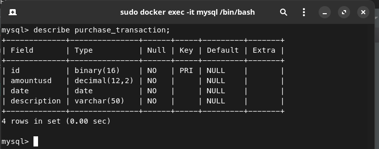

# Purchase Transaction Manager
Questions that I would ask before/after developing this project:
- Can we cache the Fiscal Treasure API or keep in our databases?
- Who is the client of the API? Auth is needed to acess its resources?
- It will run inside docker containers? How should we handle the logging, metrics and observability?

## Database


## Transaction Manager Application

The Transaction Manager Application is a REST-based Java application designed to store and manage purchase transactions and convert currencies of the amount payed. 

## Installation
Make sure you have the following mandatory software installed:
- Docker && Docker-compose
- Maven to build locally
### From Docker Hub image

To run the application, you only need to run the docker-compose build and run.   
```docker-compose up -d```

### From local build
```mvn clean package```   
After the maven build you must run:    
```docker-compose -f docker-compose-local.yml up -d```   
Or you can run with `java -jar target/transaction-manager-0.0.1-SNAPSHOT.jar`.

## API Documentation
You can acess the Swagger API docs with the application running.   
Click here -> [Documentation](http://localhost:8080/swagger-ui/index.html#/)

## Features
### A. Store and Read Purchase Transactions
The application allows users to store transactions from purchases. Users can create records of transactions with amount payed in USD, and then read these records. Transactions are stored in a MySQL database.

### B. Converting currencies
The application can receive a currency as query parameter along with the purchase transaction id to convert the amount payed in USD to any currency located in the Fiscal Data Treasure API (Country - Currency Description).   
-> [Fisca Data Treasure API](https://fiscaldata.treasury.gov/datasets/treasury-reporting-rates-exchange/treasury-reporting-rates-of-exchange)

## Technologies Used
- Java 17
- Spring Boot 3.1.5
- MySQL
- Docker
- Swagger
## Endpoints
### Create Purchase Transaction
#### POST /api/transactions
`Description:` Creates a new transaction entry with the provided details, including the amount payed, description and date. The transaction is then stored in the database. Transactions can only be created with a valid json input.   
`Request Body:` A JSON object with the following properties:   
**description** (string, required) - The description of transaction.   
**amountUSD** (number, required) - The amount payed in USD with 2 decimal digits.   
**date** (string, required) - A date in ISO date string format, "yyyy-MM-dd".   
```
{
  "description": "transaction description example",
  "date": "2023-10-02",
  "amountUSD": 10.1
}
```
`Response`: Returns the created purchase transaction in the response body along with a 201 Created status code. The response contains the transaction's ID, amountUSD, description, and date.   
```
{
    "purchaseTransaction": {
        "id": "d3f36b0d-db75-422c-8af2-613b962b8cbf",
        "amountUSD": 10.1,
        "date": "2023-10-02",
        "description": "transaction description example"
    }
}
```
### Read Transaction by ID
#### GET /api/transactions/{id} 

`Description`: Retrieves a transaction with a specific id based on the provided path parameter uuid.   
`Path Variables`:
**id**: The unique identifier of the purchase transaction for which you want to retrieve.   
`Response:` A JSON containing transaction information, including ID, amount in USD, date and description.   
```
{
    "purchaseTransaction": {
        "id": "b45eb20e-79d4-4aa5-bcec-fb9510765ec7",
        "amountUSD": 10.10,
        "date": "2023-12-02",
        "description": "transaction description example",
    }
}
```

### Read Transaction by ID with converted currency
#### GET /api/transactions/{id}?currency={currency} 
Example: `/api/transactions/b45eb20e-79d4-4aa5-bcec-fb9510765ec7?currency=Brazil-Real`

`Description`: Retrieves a transaction with a specific id based on the provided path parameter uuid among with the amount payed converted to the specified currency at the date or 6 months earlier of the transaction date.
`Path Variables`:
**id**: The unique identifier of the purchase transaction for which you want to retrieve.   
`Query Parameters`:
**currency**: The currency identifier as Country - Currency Description (country_currency_desc) in the Fiscal Data Treasure API.   
Examples: Chile-Peso, Switzerland-Franc, Brazil-Real, 	Canada-Dollar    
`Response:` A JSON containing transaction information, including ID, amount in USD, date, description, converted amount, rate of exchange and effective date of the exchange rate.   
```
{
    "purchaseTransaction": {
        "id": "b45eb20e-79d4-4aa5-bcec-fb9510765ec7",
        "amountUSD": 10.10,
        "date": "2023-12-02",
        "description": "transaction description example",
        "convertedAmount": {
            "amount": 50.83,
            "currency": "Brazil-Real",
            "effectiveDate": "2023-09-30",
            "exchangeRate": 5.033
        }
    }
}
```

### Read All transactions
#### GET /api/transactions
`Description:` Retrieves a list of all registered transactions paginated.   
`Query Parameters`:**page, size**: The page number and size of transactions per page.   
`Response:` A JSON containing a list with transaction information, including amountUSD, description, transaction ID, and date.
```
{

    "content": [
        {
            "id": "d3f36b0d-db75-422c-8af2-613b962b8cbf",
            "amountUSD": 10.10,
            "date": "2023-10-02",
            "description": "transaction description example"
        },
        {
            "id": "d9ba3b1f-7522-4fa9-b6fc-1a0cb9009b66",
            "amountUSD": 10.10,
            "date": "2023-10-02",
            "description": "transaction description example"
        },
        {
            "id": "f8bf7cc1-a9e8-4e5a-bd2d-ba5f4f0ae511",
            "amountUSD": 10.10,
            "date": "2023-10-02",
            "description": "transaction description example"
        }
    ],
    "pageable": {
        "pageNumber": 0,
        "pageSize": 10,
        "sort": {
            "empty": true,
            "sorted": false,
            "unsorted": true
        },
        "offset": 0,
        "paged": true,
        "unpaged": false
    },
    "totalPages": 1,
    "totalElements": 3,
    "last": true,
    "size": 10,
    "number": 0,
    "sort": {
        "empty": true,
        "sorted": false,
        "unsorted": true
    },
    "numberOfElements": 3,
    "first": true,
    "empty": false
}
```